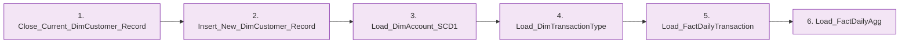
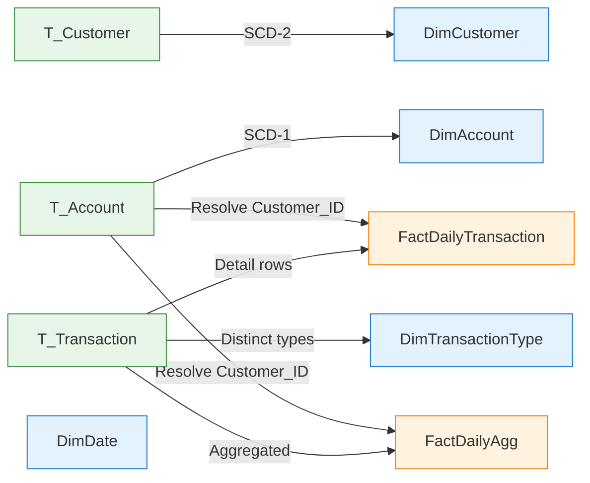
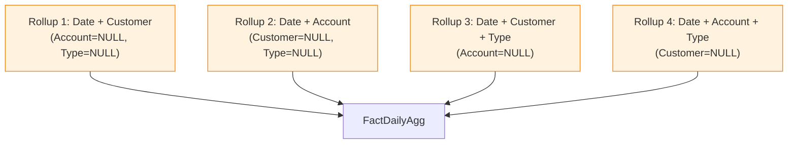

# Teradata DWH ETL Lineage

## Data Flow Diagram

```mermaid
flowchart TD
    %% ============================================================
    %% STYLING
    %% ============================================================
    classDef source fill:#e8f5e9,stroke:#388e3c,stroke-width:2px
    classDef dim fill:#e3f2fd,stroke:#1976d2,stroke-width:2px
    classDef fact fill:#fff3e0,stroke:#f57c00,stroke-width:2px
    classDef proc fill:#f3e5f5,stroke:#7b1fa2,stroke-width:1px,stroke-dasharray:5
    classDef orch fill:#fce4ec,stroke:#c62828,stroke-width:2px

    %% ============================================================
    %% SOURCE / STAGING TABLES (OLTP → Staging)
    %% ============================================================
    subgraph SOURCES["Source / Staging Tables"]
        T_Customer["T_Customer\n(Customer Master)"]:::source
        T_Account["T_Account\n(Account Data)"]:::source
        T_Transaction["T_Transaction\n(Transaction Records)"]:::source
    end

    %% ============================================================
    %% DIMENSION TABLES
    %% ============================================================
    subgraph DIMENSIONS["Dimension Tables"]
        DimCustomer["DimCustomer\n(SCD-2)"]:::dim
        DimAccount["DimAccount\n(SCD-1)"]:::dim
        DimTransactionType["DimTransactionType\n(Lookup)"]:::dim
        DimDate["DimDate\n(Calendar)"]:::dim
    end

    %% ============================================================
    %% FACT TABLES
    %% ============================================================
    subgraph FACTS["Fact Tables"]
        FactDailyTransaction["FactDailyTransaction\n(Grain: 1 row per txn)"]:::fact
        FactDailyAgg["FactDailyAgg\n(Pre-aggregated rollups)"]:::fact
    end

    %% ============================================================
    %% STORED PROCEDURES
    %% ============================================================
    subgraph PROCEDURES["ETL Stored Procedures"]
        Close_DimCust["Close_Current_DimCustomer_Record\n(SCD-2 Step 1: Expire)"]:::proc
        Insert_DimCust["Insert_New_DimCustomer_Record\n(SCD-2 Step 2: Insert)"]:::proc
        Load_DimAcct["Load_DimAccount_SCD1\n(MERGE upsert)"]:::proc
        Load_DimTxnType["Load_DimTransactionType\n(Insert-only MERGE)"]:::proc
        Pop_DimDate["Populate_DimDate\n(Loop: StartDate→EndDate)"]:::proc
        Load_FactTxn["Load_FactDailyTransaction\n(Daily detail load)"]:::proc
        Load_FactAgg["Load_FactDailyAgg\n(4 rollup INSERTs)"]:::proc
    end

    %% ============================================================
    %% ORCHESTRATOR
    %% ============================================================
    Daily_ETL["Daily_ETL_Run\n(Master Orchestrator)"]:::orch

    %% ============================================================
    %% DATA FLOW EDGES: Source → Procedure → Target
    %% ============================================================

    %% Customer SCD-2 flow
    T_Customer --> Close_DimCust
    DimCustomer --> Close_DimCust
    Close_DimCust -->|"UPDATE End_Date, Flag"| DimCustomer

    T_Customer --> Insert_DimCust
    DimCustomer -.->|"LEFT JOIN check"| Insert_DimCust
    Insert_DimCust -->|"INSERT new/changed"| DimCustomer

    %% Account SCD-1 flow
    T_Account --> Load_DimAcct
    Load_DimAcct -->|"MERGE upsert"| DimAccount

    %% Transaction Type flow
    T_Transaction --> Load_DimTxnType
    Load_DimTxnType -->|"MERGE insert-only"| DimTransactionType

    %% Date Dimension flow (no source table)
    Pop_DimDate -->|"Loop INSERT"| DimDate

    %% Fact Daily Transaction flow
    T_Transaction --> Load_FactTxn
    T_Account -->|"JOIN on Account_ID"| Load_FactTxn
    Load_FactTxn -->|"INSERT"| FactDailyTransaction

    %% Fact Daily Agg flow
    T_Transaction --> Load_FactAgg
    T_Account -->|"JOIN on Account_ID\n(Rollups 1,3)"| Load_FactAgg
    Load_FactAgg -->|"4x INSERT\n(GROUP BY rollups)"| FactDailyAgg

    %% ============================================================
    %% ORCHESTRATION CALLS
    %% ============================================================
    Daily_ETL ==>|"1"| Close_DimCust
    Daily_ETL ==>|"2"| Insert_DimCust
    Daily_ETL ==>|"3"| Load_DimAcct
    Daily_ETL ==>|"4"| Load_DimTxnType
    Daily_ETL ==>|"5"| Load_FactTxn
    Daily_ETL ==>|"6"| Load_FactAgg
```

## Execution Order (Daily_ETL_Run)

```mermaid
flowchart LR
    classDef step fill:#f3e5f5,stroke:#7b1fa2

    S1["1. Close_Current_DimCustomer_Record"]:::step
    S2["2. Insert_New_DimCustomer_Record"]:::step
    S3["3. Load_DimAccount_SCD1"]:::step
    S4["4. Load_DimTransactionType"]:::step
    S5["5. Load_FactDailyTransaction"]:::step
    S6["6. Load_FactDailyAgg"]:::step

    S1 --> S2 --> S3 --> S4 --> S5 --> S6
```

## Table-Level Lineage (Source → Target)

```mermaid
flowchart LR
    classDef source fill:#e8f5e9,stroke:#388e3c
    classDef dim fill:#e3f2fd,stroke:#1976d2
    classDef fact fill:#fff3e0,stroke:#f57c00

    TC[T_Customer]:::source
    TA[T_Account]:::source
    TT[T_Transaction]:::source

    DC[DimCustomer]:::dim
    DA[DimAccount]:::dim
    DTT[DimTransactionType]:::dim
    DD[DimDate]:::dim

    FDT[FactDailyTransaction]:::fact
    FDA[FactDailyAgg]:::fact

    TC -->|"SCD-2"| DC
    TA -->|"SCD-1"| DA
    TT -->|"Distinct types"| DTT
    TT -->|"Detail rows"| FDT
    TA -->|"Resolve Customer_ID"| FDT
    TT -->|"Aggregated"| FDA
    TA -->|"Resolve Customer_ID"| FDA
```

## FactDailyAgg Rollup Grain Detail

```mermaid
flowchart TD
    classDef rollup fill:#fff3e0,stroke:#f57c00

    FDA["FactDailyAgg"]

    R1["Rollup 1: Date + Customer\n(Account=NULL, Type=NULL)"]:::rollup
    R2["Rollup 2: Date + Account\n(Customer=NULL, Type=NULL)"]:::rollup
    R3["Rollup 3: Date + Customer + Type\n(Account=NULL)"]:::rollup
    R4["Rollup 4: Date + Account + Type\n(Customer=NULL)"]:::rollup

    R1 --> FDA
    R2 --> FDA
    R3 --> FDA
    R4 --> FDA
```
